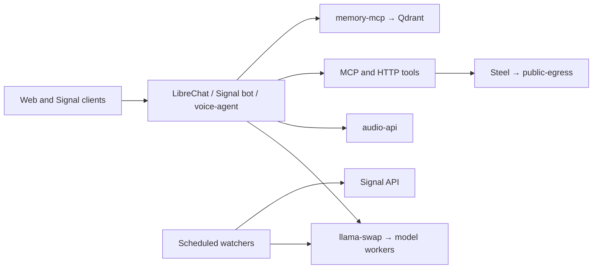

# Architecture

The server host runs user interfaces, tools, scheduled jobs, and their storage.
The AI host runs inference, audio, memory, and Qdrant. A single host can fill both
roles if it has enough resources and the configured routes are reachable.

## Services

Ports below are host-published ports unless marked internal. Reachability also
requires the host firewall, proxy, and any private-network routing.

| Service | Port | Role |
| --- | --- | --- |
| LibreChat | 3000 | Web chat; history in MongoDB |
| llama-swap | 8080, loopback | Model routing; management UI at `/ui` |
| SearXNG | 8081 | Search backed by configured providers |
| mcp-proxy | 8083 | Search, fetch, maps, GitHub, and other tools |
| location-tracker | 8084, internal | Calendar-derived location timeline |
| pdf-inspector | 8086 | PDF extraction and attachment inspection |
| voice-agent | 8087 | Browser voice chat |
| audio-api | 8088 | Speech recognition, synthesis, and cloning |
| memory-mcp | 8089 | REST and MCP memory interfaces |
| Nextcloud | 8090 | Files and CalDAV |
| reverse-image-search | 8091 | Image identification |
| browser-agent-api | 8092, loopback | Asynchronous browser tasks |
| public-api-gateway | 8093, loopback | Authenticated public chat API origin |
| public-egress | 3090 / 9293, loopback | Access to isolated Steel UI / browser websocket |
| Qdrant | 6333 | Memory vector storage |
| signal-api | 9922 | Signal account transport |
| yt-dlp-service | 8200 | Native media download service |

Watchers have no public interface. Their schedules and integration settings are
covered in [watchers](watchers.md). Shared Python helpers live in
`shared/stack_shared/`, installed into the images that use them.

## Configuration and state

Compose files define services and persistent volumes. Native `serve-*.sh`
launchers define model workers. `.env` and service-specific `*.env` files supply
operator values; tracked `*.example` files document them.

Data stays in named Docker volumes or operator-selected host directories. Keep
memory files, accounts, cookies, voice samples, media, and backups outside Git.
See [deployment](deployment.md) for the public/private configuration boundary.
